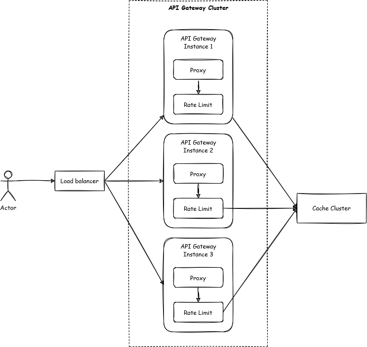

# Problem 2 - Design

Lõi của dịch vụ API Gateway có thể áp dụng một trong số các thuật toán sau:

- Token Bucket
- Leaky Bucket
- Fixed Window Counter
- Sliding Window Log
- Sliding Window Counter

2 yếu tố chính khi lựa chọn các giải thuật trên là độ chính xác và lượng tài nguyên sử dụng. Với thuật toán Sliding Window Log, độ chính xác là cao nhất tuy nhiên sử dụng tài nguyên ở mức độ lớn. Với thuật toán Fixed Window Counter có thể bị quá tải ở xung quanh thời điểm nối tiếp giữa các cửa sổ thời gian, nhưng tính triển khai dễ dàng và hiệu quả về mặt lưu trữ. Còn Sliding Window Counter cân bằng hơn giữa 2 thuật toán vừa kể và thường là một lựa chọn được áp dụng trong các giải pháp API Gateway trên thị trường.

Tài nguyên sử dụng, tài nguyên lưu trữ được đề cập ở phía trên là vùng lưu trữ, truy cập nhanh(cache). Ở phạm vi 1 instance cho API Gateway, chúng ta hoàn toàn có thể sử dụng in-memory hoặc một giải pháp cache bên thứ 3, ví dụ: Redis, Amazon ElastiCache, ... Ở phạm vi API Gateway phục vụ lượng lớn dữ liệu, sẽ yêu cầu nhiều instance để có thể chia tải trên các instance này. Nếu sử dụng in-memory, dữ liệu về counter, window không được chia sẻ giữa các instance, điều này yêu cầu stick-session cho các request tới, hoặc phải chịu sai số về rate limiting tương đối lớn. Một hướng đi để tăng độ chính xác cho toàn API Gateway Cluster là sử dụng giải pháp cache bên thứ 3. Dữ liệu có thể được chia sẻ với tốc độ nhanh giữa các instance trong cluster, tuy nhiên vấn đề phát sinh theo hướng này là độ trễ để instance có thể truy vấn tới bộ nhớ cache ở bên ngoài.

API Gateway Cluster nên được đảm bảo tính chất Auto Scaling, cho phép số lượng instance có thể tăng lên khi lượng traffic lớn và ngược lại số lượng instance giảm xuống khi lượng traffic không quá lớn, điều này sẽ giúp tối ưu chi phí cho triển khai Cluster.

Đồng thời, để không phát sinh Single Point of Failure, thì giải pháp cache cũng nên được triển khai đảm bảo tính chất High Availability.

Đứng giữa Actor với API Gateway Cluster là Load Balancer, có nhiệm vụ cân bằng tải cho các instance trong API Gateway Cluster. Yếu tổ cân bằng tải nên được xem xét trên các instance gồm tình trạng sử dụng tài nguyên RAM, CPU, Traffic.
